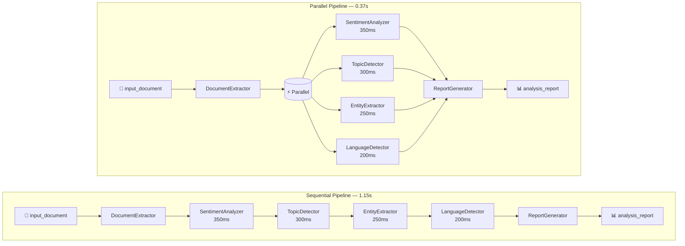

## ⚙️ Prerequisites

Please refer to prerequisites [here](../../../README.md).

## 📂 Project Setup

The folder structure for this example:

```
parallel-pipeline-processing/
├── parallel_pipeline.py
├── pyproject.toml
├── .env.example
├── .python-version
├── setup.sh
└── setup.bat
```

## 💡 Pipeline Architecture

The following diagram compares the sequential and parallel execution flows for the four independent analysis steps (sentiment, topics, entities, language):



In the **sequential** pipeline, each analysis step waits for the previous one to finish:
`extract → sentiment → topics → entities → language → report`.

In the **parallel** pipeline, the four independent analyzers execute concurrently after extraction,
cutting total latency from ~1.15s to ~0.37s — a **3× speedup**.

## 🚀 Getting Started

1. **Clone the repository & open the directory**

   ```bash
   git clone https://github.com/gdplabs/gen-ai-sdk-cookbook.git
   cd gen-ai-sdk-cookbook/gen-ai/how-to-guides/build_end_to_end_rag_pipeline/009_parallel_pipeline_processing
   ```

2. **Set UV authentication and install dependencies**

   **For Unix-based systems (Linux, macOS):**
   ```bash
   ./setup.sh
   ```

   **For Windows:**
   ```cmd
   setup.bat
   ```

3. **Run the example**

   ```bash
   uv run parallel_pipeline.py
   ```

4. **Expected Output**

   ```text
   Sequential pipeline duration: 1.15s
   Sequential pipeline report: {'sentiment': 'positive', 'topics': ['pipelines', 'parallelism', 'observability'], 'entities': ['GL SDK', 'LangGraph'], 'language': 'en'}
   Parallel pipeline duration: 0.37s
   Parallel pipeline report: {'sentiment': 'positive', 'topics': ['pipelines', 'parallelism', 'observability'], 'entities': ['GL SDK', 'LangGraph'], 'language': 'en'}
   Equivalent report: True
   Speedup: 3.07x
   ```

## 📚 Reference

These examples are based on the [GL SDK GitBook documentation](https://gdplabs.gitbook.io/sdk/gen-ai-sdk/guides/build-end-to-end-rag-pipeline/parallel-pipeline-processing).
